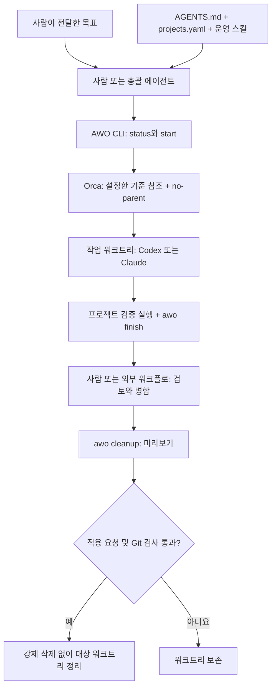

<p align="center">
  
</p>

# Agent Worktree Orchestrator

**하나의 목표, 하나의 워크트리. 작업 시작부터 정리까지 명확하게.**

Orca, Codex, Claude로 여러 Git 저장소의 AI 코딩 작업을 관리하는 작은 CLI와 운영 규칙입니다. 워크트리 상태를 확인하고, 설정한 기준 브랜치에서 독립 작업을 시작하며, 병합된 작업을 삭제하기 전에 정리 대상을 미리 확인합니다.

[](https://github.com/jakeparkcolde/agent-worktree-orchestrator/actions/workflows/ci.yml)
[](https://github.com/jakeparkcolde/agent-worktree-orchestrator/blob/main/CHANGELOG.md)
[](#현재-상태)
[](LICENSE)

[English](README.md) · **한국어**

[빠른 시작](#빠른-시작) · [왜 필요한가](#왜-필요한가) · [안전 원칙](#안전-원칙) · [사용 가이드](docs/usage.md)

## 왜 필요한가

병렬 코딩이 늘면 브랜치가 기준에서 멀어지고, 워크트리가 쌓이며, 여러 에이전트가 같은 파일을 수정할 수 있습니다. AWO는 사람이나 작업을 총괄하는 에이전트가 따를 수 있는 반복 가능한 절차와 공통 프로젝트 설정을 제공합니다.

- **목표 중심으로 작업을 유지합니다.** 운영 규칙은 같은 작업을 이어갈 때 기존 워크트리를 재사용하도록 합니다.
- **독립 작업의 시작점을 명확히 합니다.** CLI는 설정한 기준 참조를 적용하고, Orca `--no-parent`를 사용하며, 워크트리 수 제한을 확인합니다.
- **Git 상태를 보여줍니다.** 상태 확인과 마무리 명령으로 병합 전에 검토할 정보를 확인합니다.
- **끝나지 않은 작업을 보존합니다.** 정리는 미리보기가 기본이며, 삭제 전에 Git 상태를 검사합니다.

## 활용 사례

| 상황 | AWO의 역할 |
| --- | --- |
| 여러 저장소에서 작업할 때 | `projects.yaml`에 경로, 기준 참조, 작업 정책을 모읍니다. |
| 독립적인 수정이나 기능을 시작할 때 | Orca 워크트리를 만들고 Codex 또는 Claude 작업을 시작합니다. |
| 기존 목표의 작업을 이어갈 때 | 상태를 확인한 뒤 운영 규칙에 따라 기존 워크트리를 재사용합니다. |
| 작업을 마치고 병합했을 때 | 정리 대상을 미리 확인하고 조건을 충족한 워크트리만 정리합니다. |

## 빠른 시작

**macOS 또는 Linux, Git, Bash, Python 3**가 필요합니다. 작업 생성에는 **Orca CLI**와 실행할 **Codex 또는 Claude CLI**도 필요합니다. 대상 저장소는 로컬에 있어야 하며, 접근 가능한 `origin` 원격 저장소와 기준 참조가 있어야 합니다.

### 1. 복제 및 설정

```bash
git clone https://github.com/jakeparkcolde/agent-worktree-orchestrator.git
cd agent-worktree-orchestrator
cp projects.example.yaml projects.yaml
```

편집기로 `projects.yaml`을 엽니다. 예제의 단순한 들여쓰기 형식을 유지하고 프로젝트 항목을 실제 저장소 정보로 바꿉니다.

```yaml
projects:
  myapp:
    path: "/absolute/path/to/myapp"
    base_ref: "origin/main"
    max_worktrees: 3
    default_agent: "codex"
    merge_policy: "manual"
    test_command: "npm test"
    lint_command: "npm run lint"
    typecheck_command: "npm run typecheck"
```

검증 명령은 프로젝트에 맞게 바꾸세요. 이 설정은 총괄 에이전트를 위한 지침이며, `finish`가 실행하지는 않습니다. `max_worktrees`에는 기본 체크아웃도 포함되므로 `3`이면 추가 워크트리는 최대 두 개입니다.

### 2. 환경과 기존 작업 확인

```bash
./bin/awo doctor
./bin/awo status myapp
./bin/awo audit myapp
./bin/awo watch myapp
```

`doctor`는 도구 설치 여부와 설정 파일 존재 여부를 확인합니다. 시작 전에 기존 작업을 검토하세요. 같은 목표라면 기존 워크트리를 재사용하고, 같은 파일을 수정하는 작업은 조율합니다.

### 3. 독립 작업 시작

```bash
./bin/awo start myapp fix-login codex \
  "로그인 간헐 오류를 수정하고 회귀 테스트를 추가하세요."
```

이 명령은 `origin`을 가져오고, 기본 체크아웃에서 진행 중인 Git 작업이 있는지 확인하며, 기준 참조와 워크트리 수를 검사합니다. 필요하면 저장소를 Orca에 등록한 뒤 작업을 생성합니다. `--no-parent`는 Orca의 부모·자식 관계를 제어하며, Git 기준 참조는 AWO가 별도로 설정합니다.

### 4. 검증 및 검토

작업 워크트리에서 프로젝트의 테스트, 린트, 타입 검사를 실행하고 변경 내역을 검토한 뒤 의도한 변경을 커밋합니다. 그다음 다음 명령을 실행합니다.

```bash
./bin/awo finish /absolute/path/to/task-worktree
```

`finish`는 기준 대비 커밋 차이, 변경 파일, 파일명으로 추정한 위험 후보, 업스트림 상태를 보여줍니다. 비교 기준은 `origin/HEAD`이며 없으면 `origin/main`을 사용합니다. 현재 프로젝트의 `base_ref`는 읽지 않으므로 설정한 기준이 다르면 별도로 검토하세요. PR 생성이나 병합은 병합 정책에 따라 진행합니다.

### 5. 병합 후 정리 미리보기

```bash
./bin/awo cleanup myapp
```

미리보기를 검토한 후 실제로 정리하려면 다음 명령을 실행합니다.

```bash
./bin/awo cleanup myapp --worktree /absolute/path/to/task-worktree --apply
```

## 아키텍처



AWO는 스크립트와 정책을 제공합니다. 사람이나 총괄 에이전트가 목표, 검증, 승인, 병합을 조율하고 Orca가 워크트리 작업을 실행합니다. [아키텍처](docs/architecture.md)와 [Orca 연동](docs/orca-integration.md) 문서에서 자세히 설명합니다.

## 안전 원칙

> Git 상태로 안전을 확인할 수 없으면 작업을 보존합니다.

정리는 **미리보기가 기본**입니다. 실제 적용에는 `--worktree <정확한-경로>`
또는 명시적인 `--all-safe`가 필요합니다. 고유 커밋이 없어도 새 워크트리와
최근 작업은 보호됩니다. 커밋 계보, 패치 동등성, 최종 트리 차이를 별도로
검사하며, 최종 차이가 남아 있으면 자동 삭제하지 않습니다. 미커밋 변경,
산출물, 추적 중인 런타임 파일, 확인할 수 없는 상태도 정리를 막습니다.
강제 옵션 없이 워크트리를 제거하고 브랜치는 보존합니다.

생성 시각을 모르면 처음 발견한 시점부터 보수적으로 보호합니다. 기본은
24시간 ACTIVE, 깨끗한 워크트리는 72시간 ACTIVE_IDLE입니다. 작은 차이만으로
의미적 동등성을 인증하지 않으며, 검증된 아카이브 기능은 후속 과제입니다.
[v0.2 로드맵](ROADMAP.md)에서 범위와 한계를 확인하세요.

운영 규칙은 `orca worktree rm --force`, `git branch -D`, `git reset --hard`, `git clean -fd`, `git push --force`의 자동 실행을 금지합니다.

스키마·마이그레이션, 인증·인가, 결제, 운영 인프라, 비밀정보, 파괴적인 데이터 작업, 권한, 외부 API 호환성 파괴, 주요 아키텍처 변경에는 사람의 승인이 필요합니다. 파일명 기반 위험 표시는 전체 위험 평가를 대신하지 않습니다.

| 병합 정책 | 책임 |
| --- | --- |
| `manual` | 사람이 병합 여부를 결정합니다. 처음에는 이 설정을 사용하세요. |
| `review` | 총괄 워크플로가 PR 리뷰 절차를 따릅니다. |
| `auto` | 외부 오케스트레이터가 검증 후 위험이 낮은 작업을 병합할 수 있습니다. |

이 정책은 총괄 워크플로의 지침입니다. CLI가 승인을 강제하거나 PR을 병합하지는 않습니다. [안전 모델](docs/safety-model.md)과 [워크스페이스 운영 규칙](AGENTS.md)을 확인하세요.

## 현재 상태

**v0.2.0 · 실험 단계.** 원격 백업에서 복구할 수 있는 저장소에서 `merge_policy: "manual"`로 시작하세요.

v0.2는 감사 결과에 내용 비교와 발견 메타데이터를 추가합니다. watch는
24/72/168시간 기준과 워크트리 수 제한을 확인하며, 선택적인 macOS 알림과
launchd 스크립트로 주기적 확인을 지원합니다. 검증된 아카이브와 의미적
동등성 자동 인증은 후속 과제입니다. 같은 목표의 워크트리 자동 재사용,
수정 파일 중복 탐지, 설정한 테스트 실행, PR 생성과 병합은 사람 또는
총괄 에이전트가 맡습니다.

[v0.2 로드맵](ROADMAP.md)과 [변경 이력](CHANGELOG.md)을 확인하세요.

## 자연어로 작업 시작하기 — 계획 단계

예를 들어 “AWO 카카오 비서관련 레포 작업 하고 싶다”라고 요청하면, 향후
Codex 총괄 흐름이 등록된 프로젝트 이름·별칭으로 저장소를 찾고 같은 목표의
워크트리가 있는지 먼저 확인하도록 할 수 있습니다. 독립 작업이면 설정된
`base_ref`(보통 `origin/main`)에서 시작하고, 기존 작업을 이어가면 재사용합니다.
저장소가 모호하거나 구체적인 작업 목표가 빠졌을 때만 추가로 묻습니다.

**현재 CLI에는 자연어 해석이나 별칭 기능이 없습니다.** 총괄 에이전트가
프로젝트, 작업 이름, 목표를 정해 기존 `awo start`에 전달해야 합니다.
저장소를 언급했다는 이유만으로 예비 워크트리를 만들지는 않습니다.
[계획된 흐름](ROADMAP.md#planned-natural-language-entry-flow)을 참고하세요.

## 문서와 기여

- [사용 가이드](docs/usage.md) — 명령 상세
- [운영 스킬](skills/git-orchestrator/SKILL.md) — 총괄 에이전트용 지침
- [기여 안내](CONTRIBUTING.md) — 작고 검토 가능한 변경을 환영합니다
- [보안 정책](SECURITY.md) — 보안 문제 제보

안전 관련 변경에는 가능하면 회귀 테스트를 포함해 주세요.

## 라이선스

[MIT](LICENSE)
