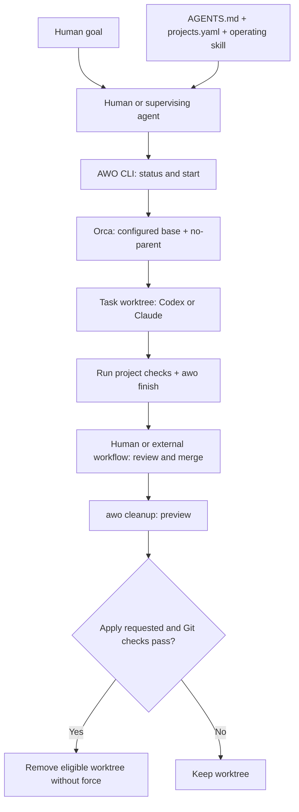

<p align="center">
  
</p>

# Agent Worktree Orchestrator

**One goal. One worktree. A clearer path from task to cleanup.**

A small CLI and operating contract for managing AI coding work across Git repositories with Orca, Codex, and Claude. Inspect worktrees, start independent tasks from a configured base, and preview cleanup before removing merged work.

[](https://github.com/jakeparkcolde/agent-worktree-orchestrator/actions/workflows/ci.yml)
[](https://github.com/jakeparkcolde/agent-worktree-orchestrator/blob/main/CHANGELOG.md)
[](#status)
[](LICENSE)

**English** · [한국어](README.ko.md)

[Quick Start](#quick-start) · [Why](#why) · [Safety](#safety) · [Usage guide](docs/usage.md)

## Why

Parallel coding creates more than code: branches drift, worktrees accumulate, and agents can collide on shared files. AWO gives the human or supervising agent a repeatable workflow and a shared project registry.

- **Keep work tied to a goal.** The operating contract calls for reusing a worktree when continuing the same task.
- **Start independent work deliberately.** The CLI sets the configured base ref, uses Orca `--no-parent`, and checks the worktree limit.
- **Make Git state visible.** Status and finish commands report the state you need to review before merging.
- **Preserve unfinished work.** Cleanup defaults to a preview and checks Git state before removal.

## Use cases

| Situation | How AWO helps |
| --- | --- |
| You work across several repositories | Store paths, base refs, and workflow preferences in `projects.yaml`. |
| You start an independent fix or feature | Create an Orca worktree and launch a Codex or Claude task. |
| You return to an existing goal | Inspect status, then reuse the worktree under the operating contract. |
| You have finished and merged a task | Preview cleanup; apply it only to eligible worktrees. |

## Quick Start

Requires **macOS or Linux, Git, Bash, and Python 3**. Task creation also requires the **Orca CLI** and the **Codex or Claude CLI** you intend to launch. The target repository must already exist locally with an accessible `origin` remote and base ref.

### 1. Clone and configure

```bash
git clone https://github.com/jakeparkcolde/agent-worktree-orchestrator.git
cd agent-worktree-orchestrator
cp projects.example.yaml projects.yaml
```

Edit `projects.yaml` with your editor. Keep the example's simple indentation and replace the project entry with your repository details:

```yaml
projects:
  myapp:
    path: "/absolute/path/to/myapp"
    base_ref: "origin/main"
    max_worktrees: 3
    default_agent: "codex"
    merge_policy: "manual"
    test_command: "npm test"
    lint_command: "npm run lint"
    typecheck_command: "npm run typecheck"
```

Use validation commands appropriate to your project. They are guidance for the supervising agent; `finish` does not run them. `max_worktrees` includes the primary checkout, so `3` allows up to two additional worktrees.

### 2. Check the environment and current work

```bash
./bin/awo doctor
./bin/awo status myapp
./bin/awo audit myapp
./bin/awo watch myapp
```

`doctor` checks tool availability and the configuration file's presence. Review existing work before starting: reuse an existing worktree for the same goal and coordinate overlapping file edits.

### 3. Start an independent task

```bash
./bin/awo start myapp fix-login codex \
  "Fix the intermittent login failure and add regression tests."
```

This checks the configured base and worktree count, then requests an independent Orca worker with the explicit goal. `--no-parent` controls Orca lineage; the configured base selects the Git starting point. Inspect the dispatch receipt before claiming the worker is ready or running.

The primary checkout remains the coordinator's dispatch context, available for
other task assignments. Implementation belongs to a separate Orca worker
terminal bound to the exact task worktree, with the goal explicitly delivered.
Treat **worktree created**, **session ready**, and **turn started** as separate
facts. If dispatch stops partway, preserve the worktree and repair the handoff;
the coordinator must not enter it and implement as an automatic fallback.
See [Orca dispatch](docs/orca-integration.md) for evidence and reuse details.
An existing worktree with no terminals receives a separate Codex/Claude worker.
Unknown existing terminals block dispatch by default. If you know they are only
shells with no worker, explicitly add `--new-session` alongside `--worktree PATH`;
a positively identified agent still blocks duplication.

### 4. Validate and review

Run your project's tests, lint, and type checks in the task worktree, review the diff, and commit the intended changes. Then run:

```bash
./bin/awo finish /absolute/path/to/task-worktree
```

`finish` reports ahead/behind counts, changed files, filename-based risk candidates, and upstream status. It compares against `origin/HEAD`, falling back to `origin/main`; it currently does not read the project's `base_ref`. Review against your configured base separately if it differs. Follow your merge policy to open a PR or merge.

### 5. Preview cleanup after merging

```bash
./bin/awo cleanup myapp
```

After reviewing the preview, apply cleanup with:

```bash
./bin/awo cleanup myapp --worktree /absolute/path/to/task-worktree --apply
```

## Architecture



AWO supplies scripts and policy. The human or supervising agent coordinates goals, validation, approval, and merging; Orca runs the worktree task. See [architecture](docs/architecture.md) and [Orca integration](docs/orca-integration.md).

## Safety

> If safety cannot be proven from Git state, preserve the work.

Cleanup is **dry-run by default**. Applying it requires `--worktree <exact-path>`
or explicit `--all-safe`. New and recently active worktrees remain protected,
even with zero unique commits. AWO compares topology, patch equivalence and
final tree differences separately; a nonzero final diff prevents removal.
Dirty state, artifacts, tracked runtime and incomplete evidence block cleanup.
Removal uses Git without force and preserves branches.

Unknown creation time is treated conservatively: protection starts when AWO
first discovers the worktree. Defaults are 24 hours ACTIVE and 72 hours
ACTIVE_IDLE for a clean checkout. Inspection does not certify semantic
identity or verified archival. See the [v0.2 roadmap](ROADMAP.md) for limits.

The operating contract prohibits automatically using `orca worktree rm --force`, `git branch -D`, `git reset --hard`, `git clean -fd`, or `git push --force`.

Human approval is required for schema/migrations, authentication/authorization, billing/payments, production infrastructure, secrets, destructive data operations, permissions, breaking external APIs, and major architecture changes. Filename-based risk hints are not a complete risk assessment.

| Merge policy | Responsibility |
| --- | --- |
| `manual` | A human decides whether to merge. Start here. |
| `review` | The supervising workflow follows PR review. |
| `auto` | An external orchestrator may merge low-risk work after validation. |

These policies guide the supervising workflow; the CLI does not enforce approval or merge PRs. Read the [safety model](docs/safety-model.md) and [workspace contract](AGENTS.md).

## Status

**v0.2.0 · Experimental.** Start with `merge_policy: "manual"` on repositories recoverable from remote backups.

The v0.2 audit adds content evidence and discovery metadata to worktree
inspection. Watch alerts use 24/72/168-hour thresholds and the project worktree
limit. Optional macOS notifications and launchd scripts support periodic checks.
Verified archival and automatic semantic-equivalence certification are deferred.
Automatic same-goal reuse, overlap detection, configured test execution, PR
creation and merging remain duties of the human or supervising agent.

See the [v0.2 roadmap](ROADMAP.md) and [changelog](CHANGELOG.md).

## Documentation and contributing

- [Usage guide](docs/usage.md) — command details
- [Operating skill](skills/git-orchestrator/SKILL.md) — guidance for supervising agents
- [Contributing](CONTRIBUTING.md) — small, auditable changes welcome
- [Security policy](SECURITY.md) — reporting security issues

Safety changes should include a regression test when possible.

## License

[MIT](LICENSE)
